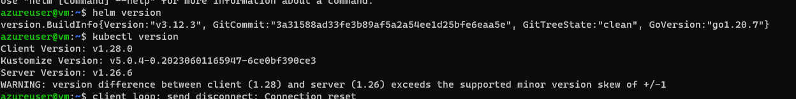
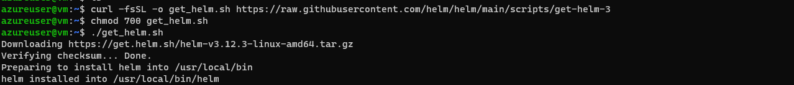
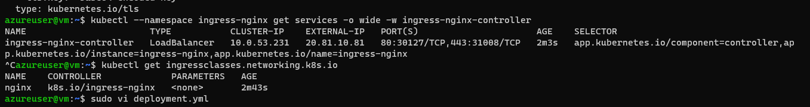
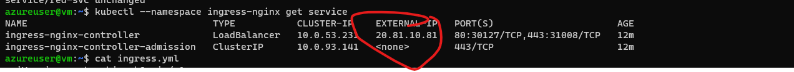
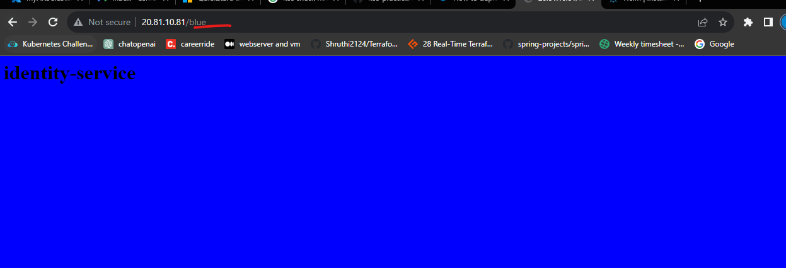
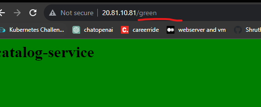
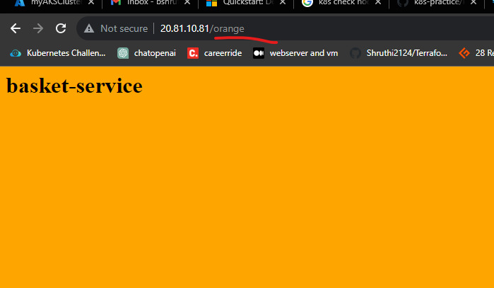
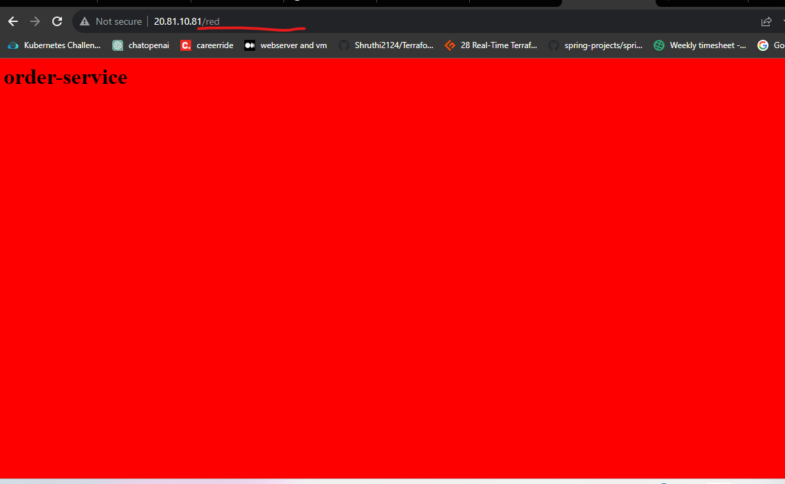

**NGINX ingress controller:**

**Install AKS using Az CLI**
**Install Helm :** 

```
curl -fsSL -o get_helm.sh https://raw.githubusercontent.com/helm/helm/main/scripts/get-helm-3
chmod 700 get_helm.sh
./get_helm.sh
```
**Check Helm version:**
```
helm version
```



**Install nginx ingress controller:** 
```
helm repo add nginx-stable https://helm.nginx.com/stable
helm repo update
helm upgrade --install ingress-nginx ingress-nginx \
             --repo https://kubernetes.github.io/ingress-nginx \
             --namespace ingress-nginx --create-namespace
```


Now apply deployment,service and ingress yaml files -


To see storage class: 


Use any below commands: 
```
kubectl --namespace ingress-nginx get service
 kubectl --namespace ingress-nginx get services -o wide -w ingress-nginx-controller
```







