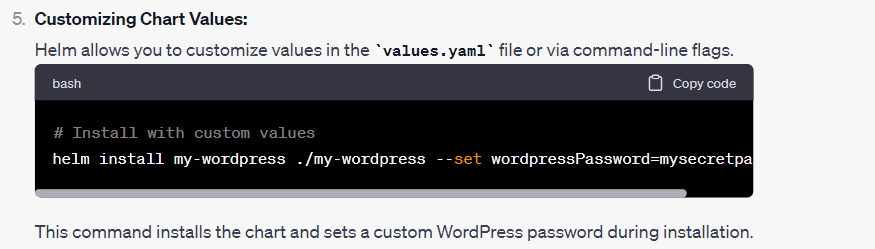

**inter cluster communication in k8s**
In Kubernetes (k8s), inter-cluster communication refers to communication between different clusters of nodes within a Kubernetes cluster. Kubernetes itself is designed to manage containerized applications and services within a single cluster, and by default, communication between pods and services within the same cluster is handled efficiently. However, there might be scenarios where you need to establish communication between different Kubernetes clusters, which is often referred to as "inter-cluster communication."

**Here are a few common approaches to achieve inter-cluster communication in Kubernetes:**

**Federation:**
Kubernetes Federation allows you to manage multiple Kubernetes clusters as a single entity. This can include managing resources and applications across different clusters, including service discovery and load balancing across clusters. While Federation v1 has been deprecated, the new approach for managing multiple clusters is through the "cluster API."

**Cluster API:**
The Cluster API is a Kubernetes project that provides declarative APIs and tooling to manage clusters and their lifecycle. It helps you create and manage clusters across different cloud providers and on-premises environments. It simplifies the process of provisioning and managing Kubernetes clusters in different locations.

**Service Mesh:**
Service meshes like Istio, Linkerd, and Consul Connect can provide inter-cluster communication capabilities. They allow you to control and monitor communication between services across clusters, enabling features like load balancing, security, and traffic management.

**Ingress Controllers:** 
Ingress controllers like Nginx Ingress or Traefik can be configured to handle traffic from outside the cluster and distribute it to services running in different clusters. By setting up proper ingress rules and cross-cluster networking configurations, you can achieve inter-cluster communication.

**Global DNS and Load Balancing:**
Setting up a global DNS and load balancing solution can help route traffic between different clusters based on domain names. Services can be configured to use this DNS for inter-cluster communication.

**Hybrid Cloud Solutions:**
If you have applications deployed across multiple cloud providers or on-premises environments, some hybrid cloud solutions offer inter-cluster communication features to connect and manage resources seamlessly.

It's important to note that establishing inter-cluster communication can be complex and might involve network considerations, security configurations, and management overhead. Depending on your use case and requirements, you may choose one or a combination of these approaches to achieve the desired level of inter-cluster communication in Kubernetes. Always ensure you're following best practices and considering the security implications when setting up inter-cluster communication.

----------------------------------------------------------------------------------------
**give me examples of helm ?**
Certainly! Here are a few examples of how you can use Helm to deploy applications in Kubernetes using Helm charts:
Deploying a WordPress Application:
Let's say you want to deploy a WordPress application along with a MySQL database.

This example assumes you've created a Helm chart named my-wordpress and modified the values.yaml file to set 

**Deploying Prometheus Monitoring Stack:**
Helm can be used to deploy complex applications like the Prometheus monitoring stack.

In this example, you're adding the Prometheus Helm repository and then installing the Prometheus chart from that repository.

**Deploying Nginx Ingress Controller:**
Helm can also be used to deploy and manage Kubernetes ingress controllers like Nginx.

Here, you're adding the Nginx Helm repository and then installing the Nginx Ingress Controller chart.

**Deploying a Redis Cache:**
Helm can be used to deploy stateful applications like Redis.

In this example, you're adding the Bitnami Helm repository and installing the Redis chart.

**Customizing Chart Values:**
Helm allows you to customize values in the values.yaml file or via command-line flags.

Remember that these examples assume you have Helm installed in your Kubernetes environment. You can explore various Helm charts available in different repositories, or even create your own charts tailored to your application's requirements. Helm provides a powerful and standardized way to manage deployments, upgrades, and configurations for Kubernetes applications.