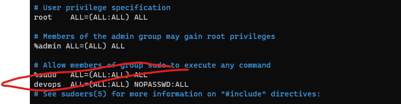
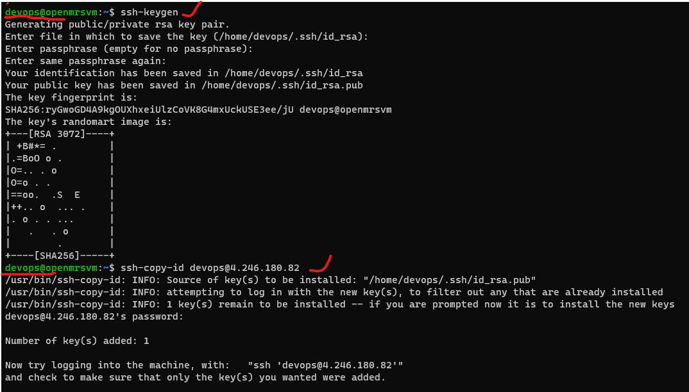
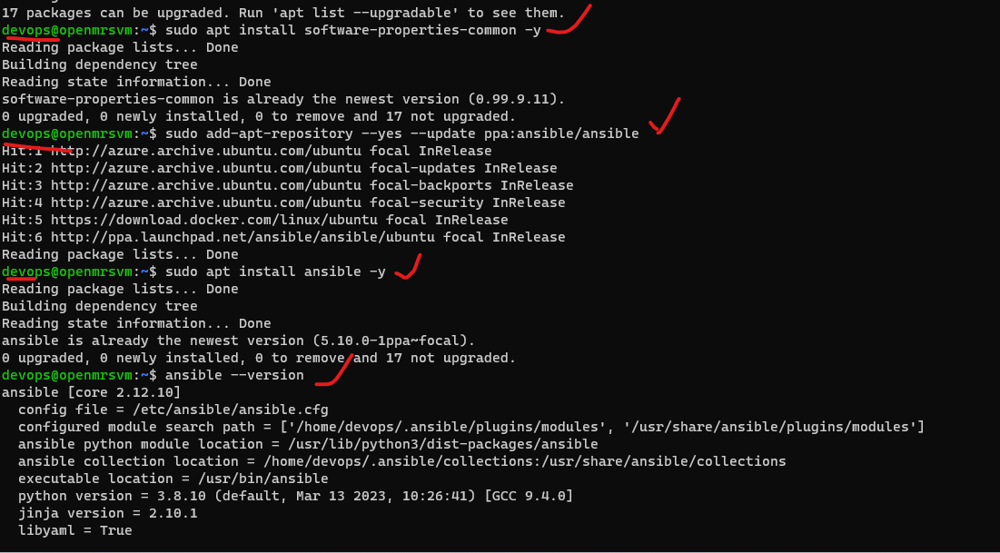
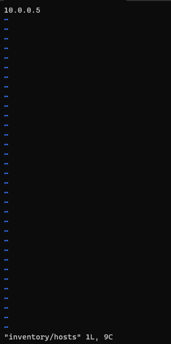
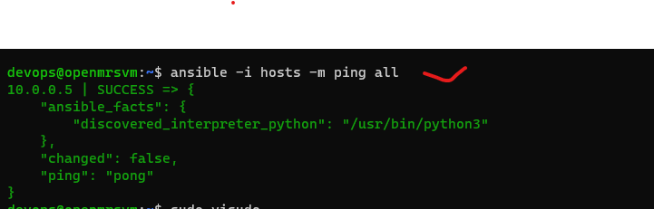

**Configuration Management (CM)**
## There are two types of CM
   Pull based CM
   Push Based CM
### Direction of Communication
   PULL => Node to CM server
   Push => CM Server to Node

** Ansible is push based communication**

**What is required in PULL Based CM?
Agent needs to be installed with necessary credentials to connect to CM Server

**What is required in Push Based CM
   List of nodes (inventory)
   Credentials to login into node

**Popular tools**
**Pull**:
Chef
Puppet
**Push**:
Ansible
SaltStack

**Ansible control node can execute desired state on nodes using**
adhoc commands
playbooks
Playbooks are YAML files.

**Installing and Configuring Ansible**
We will create two ubuntu vms
Create a user called devops in two vms and with sudo permissions
-- sudo adduser devops

**Login Devopsuser: **

--sudo visudo (add devops user in sudoers)

**Generate sshkey only on Ansible master/controlplane of devopsuser:**

-- ssh-keygen

-- ssh-copy-id username@ipadd of node

**Installing ansible on master**
--sudo apt update
--sudo apt install software-properties-common -y
--sudo add-apt-repository --yes --update ppa:ansible/ansible
--sudo apt install ansible -y

**Now lets add inventory, Create a file called as hosts with one entry <ipaddress>**
mkdir inventory
sudo vi inventory/hosts

**Check connectivity by executing **    
ansible -m ping -i inventory/hosts all
ansible -m ping -i hosts all

