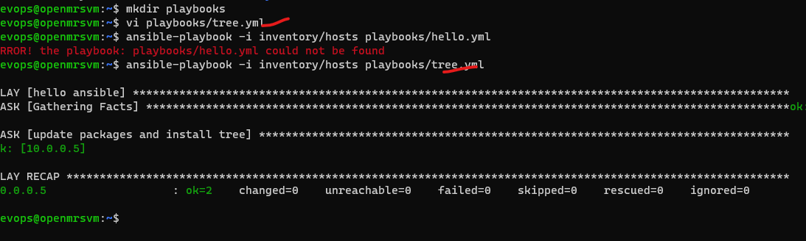

**first playbook **
--mkdir playbooks
--vi playbooks/tree.yml
```yaml
---
- name: hello ansible
  hosts: all
  become: yes
  tasks:
    - name: update packages and install tree
      apt:
        name: tree
        state: present
        update_cache: yes

---
```
ansible-playbook -i inventory/hosts playbooks/tree.yml
