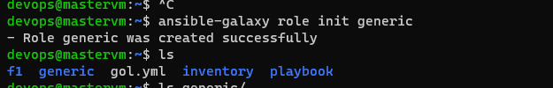
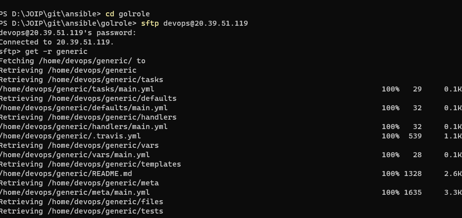
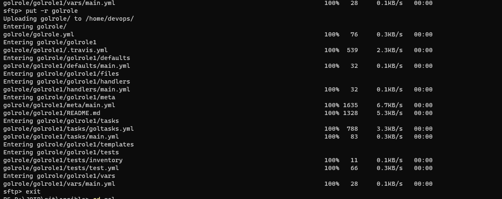

**Creating role for GOL: **
- ansible-galaxy role init generic
  
using sftp downloaded the generic role: set path before downloading
 
 - moved all tasks to tasks/goltasks and main.yml updated by include_tasks module
- upload everthing to masternode using sftp 
  
  
