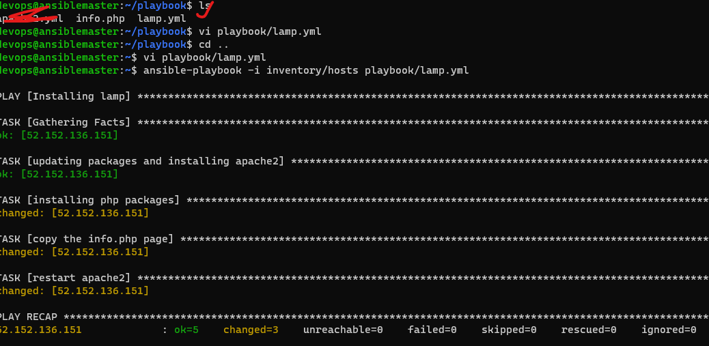
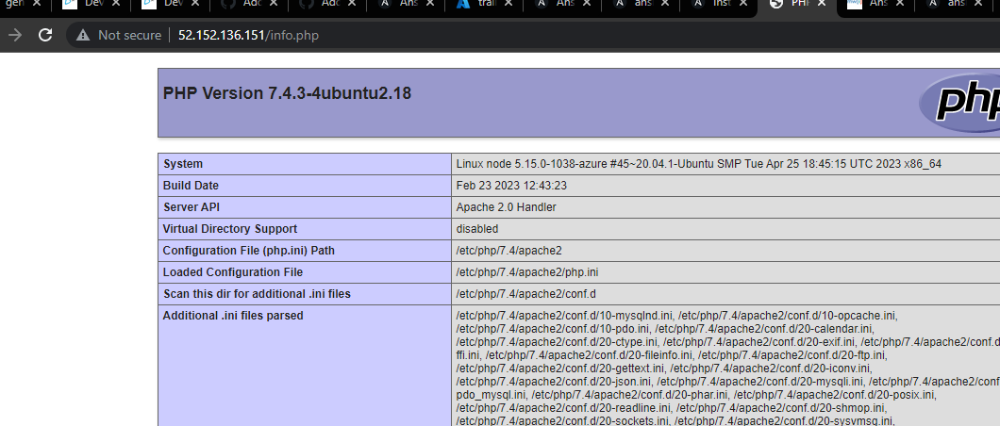

**INSTALL LAMP ON UBUNTU:**
Manual steps: 
sudo apt update
sudo apt install apache2 -y
sudo apt install php libapache2-mod-php php-mysql -y
# Create a file called as /var/www/html/info.php with below content
# <?php phpinfo(); ?>
sudo -i
echo '<?php phpinfo(); ?>' > /var/www/html/info.php
exit
sudo systemctl restart apache2

```yaml
- name: Installing lamp
  hosts: all
  become: yes 
  tasks:
    - name: updating packages and installing apache2
      ansible.builtin.apt:
        name: apache2
        update_cache: yes
        status: present
    - name: installing php packages
      ansible.builtin.apt:
        name:
          - php
          - libapache2-mod-php
          - php-mysql
        state: present
    - name: copy the info.php page
      ansible.builtin.copy:
        src: info.php
        dest: /var/www/html/info.php
    - name: restart apache2
      ansible.builtin.systemd:
        name: apache2
        state: restarted
```

``` info.php
<?php phpinfo(); ?>
```


created playbook folder with 2 files: 
  --info.php
  --lamp.yml

  -- ansible-playbook -i <inventory path> <playbookpath>
     ansible-playbook -i inventory/hots playbook/lamp.yml


----
o/p: nodeip/info.php



