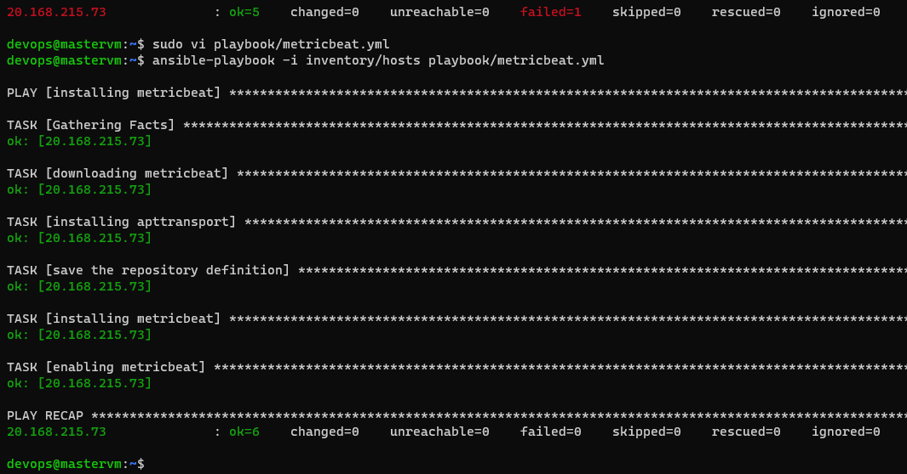
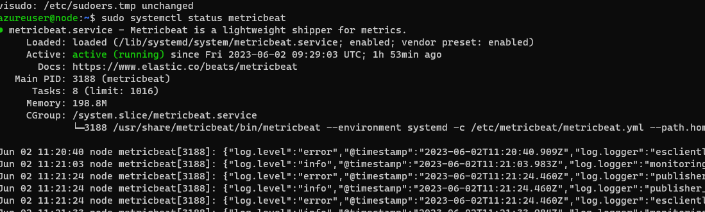
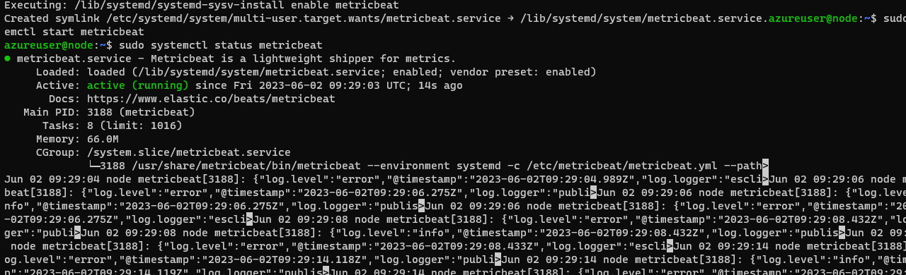

**Installing metricbeat in ansible: **
``` yaml
- name: installing metricbeat
  hosts: all
  become: yes
  tasks: 
    - name: downloading metricbeat
      ansible.builtin.apt_key: 
        url: https://artifacts.elastic.co/GPG-KEY-elasticsearch 
        state: present
    - name: installing apttransport 
      ansible.builtin.apt: 
        name: apt-transport-https
        update_cache: yes
        state: present
    - name: save the repository definition
      ansible.builtin.apt_repository: 
        repo: "deb https://artifacts.elastic.co/packages/8.x/apt stable main"
        filename: /etc/apt/sources.list.d/elastic-8.x.list  
        update_cache: true
        state: present
    - name: installing metricbeat
      ansible.builtin.apt: 
        name: metricbeat
        update_cache: yes
        state: present
    - name: enabling metricbeat
      ansible.builtin.systemd: 
        name: metricbeat
        enabled: true
        state: started
```

on Node: 

**Manual steps : **
wget -qO - https://artifacts.elastic.co/GPG-KEY-elasticsearch | sudo apt-key add -
sudo apt-get install apt-transport-https
echo "deb https://artifacts.elastic.co/packages/8.x/apt stable main" | sudo tee -a /etc/apt/sources.list.d/elastic-8.x.list
sudo apt-get update && sudo apt-get install metricbeat
sudo systemctl enable metricbeat
sudo systemctl start metricbeat
sudo systemctl status metricbeat


-----------------------------------------------------------
1.**Download and install the Public Signing Key:**

wget -qO - https://artifacts.elastic.co/GPG-KEY-elasticsearch | sudo apt-key add -

searched for the module public sigining key: 
    ansible.builtin.apt_key: 
    used related parameters

2. **Install the apt-transport-https package on Debian before proceeding:**

sudo apt-get install apt-transport-https

searched for apt-get module in ansible :
        ansible.builtin.apt: 
        used related parameters 

3. **Save the repository definition to /etc/apt/sources.list.d/elastic-8.x.list:**

echo "deb https://artifacts.elastic.co/packages/8.x/apt stable main" | sudo tee -a /etc/apt/sources.list.d/elastic-8.x.list

searched for save the repository in ansible: 
   ansible.builtin.apt_repository: 
           used related parameters 

4. **you can install Metricbeat by running:**

sudo apt-get update && sudo apt-get install metricbeat

 searched for apt-get in ansible: 
   ansible.builtin.apt: 
   used related parameters , here I only installed metricbeat, updating done by update_cache.

5. **Starting and Enabling: **
 sudo systemctl enable metricbeat
   searched for systemctl in ansible 
    used related parameters
      state: started - here metricbeat will start 
      enabled: true - here metricbeat will enable


    


   


   


