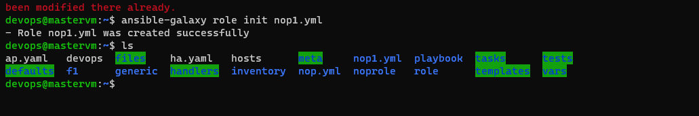
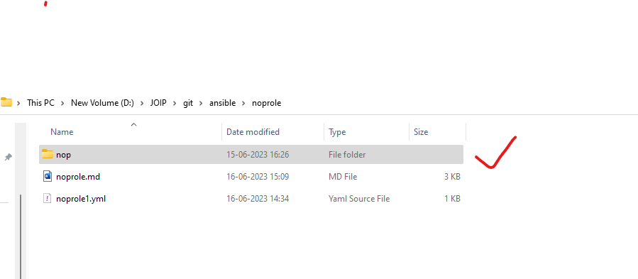
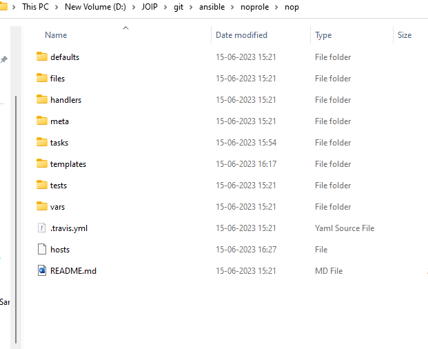
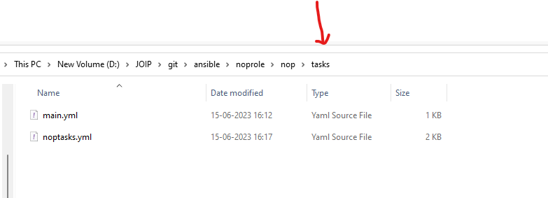
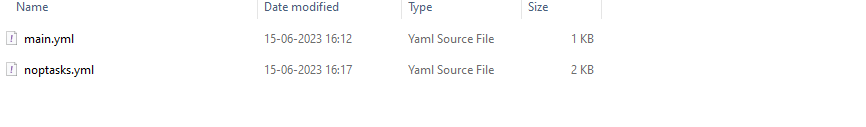
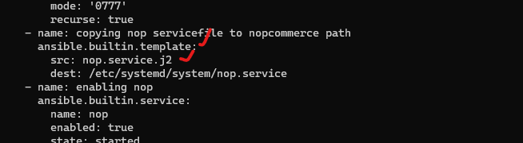
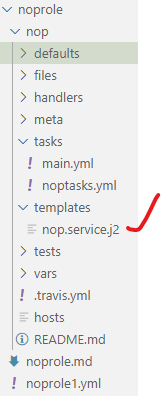
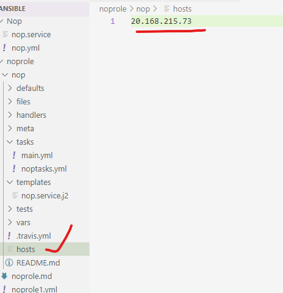
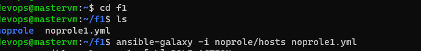
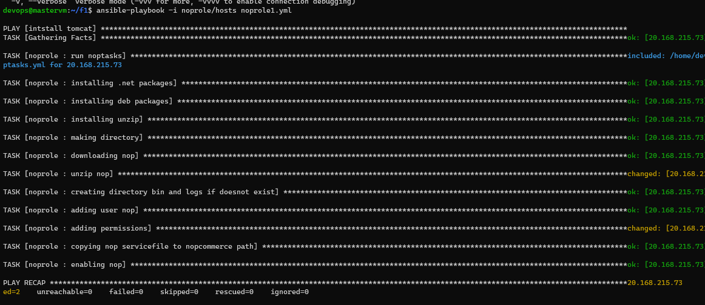

**Creating nopCommerce role :**

**nopCommerce playbook:**
```
- name: installing nopcommerce
  hosts: all 
  become: yes
  tasks: 
    - name: installing .net packages
      ansible.builtin.get_url:
        url: https://packages.microsoft.com/config/ubuntu/20.04/packages-microsoft-prod.deb
        dest: /tmp/packages-microsoft-prod.deb
    - name: installing deb packages
      ansible.builtin.apt:
        deb: /tmp/packages-microsoft-prod.deb
    - name: installing unzip
      ansible.builtin.apt: 
        name: unzip
        state: present
        update_cache: true
    - name: making directory
      ansible.builtin.file: 
        path: /usr/share/nopCommerce
        state: directory
    - name: downloading nop
      ansible.builtin.get_url: 
        url: https://github.com/nopSolutions/nopCommerce/releases/download/release-4.60.3/nopCommerce_4.60.3_NoSource_linux_x64.zip
        dest: /usr/share/nopCommerce
    - name: unzip nop 
      ansible.builtin.unarchive:
        src: /usr/share/nopCommerce/nopCommerce_4.60.3_NoSource_linux_x64.zip
        dest: /usr/share/nopCommerce
        remote_src: true
    - name: creating directory bin and logs if doesnot exist
      ansible.builtin.file:
        path: 
          - /usr/share/nopCommerce/bin
          - /usr/share/nopCommerce/logs
        state: directory
    - name: adding user nop 
      ansible.builtin.user:
        name: nop
    - name: adding permissions
      ansible.builtin.file:
        path: /usr/share/nopCommerce
        owner: nop
        group: nop 
        state: directory 
        mode: '0777'
        recurse: true
    - name: copying nop servicefile to nopcommerce path
      ansible.builtin.copy: 
        src: nop.service
        dest: /etc/systemd/system/nop.service
    - name: enabling nop
      ansible.builtin.service: 
        name: nop 
        enabled: true
        state: started

``` 
Nop servicefile: 
```
[Unit]
Description=Example nopCommerce app running on Xubuntu

[Service]
WorkingDirectory=/usr/share/nopCommerce
ExecStart=/usr/bin/dotnet /usr/share/nopCommerce/Nop.Web.dll
Restart=always
# Restart service after 10 seconds if the dotnet service crashes:
RestartSec=10
KillSignal=SIGINT
SyslogIdentifier=nopCommerce-example
User=nop
Environment=ASPNETCORE_ENVIRONMENT=Production
Environment=ASPNETCORE_URLS=http://0.0.0.0:5000
Environment=DOTNET_PRINT_TELEMETRY_MESSAGE=false

[Install]
WantedBy=multi-user.target
```
**Commands:**
 -- ansible-galaxy role init nop.yml(name of the playbook, which converts into a role)
   one role will get created with all the required folders, hilighted ones in the screenshot are created

we have to download those folder into our local machine using sftp
---sftp devops@ip
--- get -r <nameoftherole/yamlname>
it will download to the local folder



now arraging everything according to the folders: 
-defaults: nothing to change
-files: nothing to change
-handlers: nohing to change
-meta: nothing to change
-tasks: moved all the tasks here



main.yml- just added module for including tasks
```
- name: run noptasks
  ansible.builtin.include_tasks: 
    file: noptasks.yml
```
noptasks.yml - moved to this yaml
```
 - name: installing .net packages
      ansible.builtin.get_url:
        url: https://packages.microsoft.com/config/ubuntu/20.04/packages-microsoft-prod.deb
        dest: /tmp/packages-microsoft-prod.deb
    - name: installing deb packages
      ansible.builtin.apt:
        deb: /tmp/packages-microsoft-prod.deb
    - name: installing unzip
      ansible.builtin.apt: 
        name: unzip
        state: present
        update_cache: true
    - name: making directory
      ansible.builtin.file: 
        path: /usr/share/nopCommerce
        state: directory
    - name: downloading nop
      ansible.builtin.get_url: 
        url: https://github.com/nopSolutions/nopCommerce/releases/download/release-4.60.3/nopCommerce_4.60.3_NoSource_linux_x64.zip
        dest: /usr/share/nopCommerce
    - name: unzip nop 
      ansible.builtin.unarchive:
        src: /usr/share/nopCommerce/nopCommerce_4.60.3_NoSource_linux_x64.zip
        dest: /usr/share/nopCommerce
        remote_src: true
    - name: creating directory bin and logs if doesnot exist
      ansible.builtin.file:
        path: 
          - /usr/share/nopCommerce/bin
          - /usr/share/nopCommerce/logs
        state: directory
    - name: adding user nop 
      ansible.builtin.user:
        name: nop
    - name: adding permissions
      ansible.builtin.file:
        path: /usr/share/nopCommerce
        owner: nop
        group: nop 
        state: directory 
        mode: '0777'
        recurse: true
    - name: copying nop servicefile to nopcommerce path
      ansible.builtin.template: 
        src: nop.service.j2
        dest: /etc/systemd/system/nop.service
    - name: enabling nop
      ansible.builtin.service: 
        name: nop 
        enabled: true
        state: started
```

here for service file, we used templates, so module has changed-ansible


Servicefile should coiped to templates and saved as nop.service.j2- this name should match with noptasks.yml file, refere above !
```
[Unit]
Description=Example nopCommerce app running on Xubuntu

[Service]
WorkingDirectory=/usr/share/nopCommerce
ExecStart=/usr/bin/dotnet /usr/share/nopCommerce/Nop.Web.dll
Restart=always
# Restart service after 10 seconds if the dotnet service crashes:
RestartSec=10
KillSignal=SIGINT
SyslogIdentifier=nopCommerce-example
User=nop
Environment=ASPNETCORE_ENVIRONMENT=Production
Environment=ASPNETCORE_URLS=http://0.0.0.0:5000
Environment=DOTNET_PRINT_TELEMETRY_MESSAGE=false

[Install]
WantedBy=multi-user.target
```


---tests: nothing should be changed
---vars: nochange
---.travil.yml: nochange

---hosts: 
update node ipaddress here-



---now writing role
noprole1.yml
```
- name: intstall tomcat
  become: yes
  hosts: all
  roles: 
    - noprole (folder name where the all files are downloaded)
```
command to execute: 
ansible-playbook -i noprole/hosts noprole1.yml




