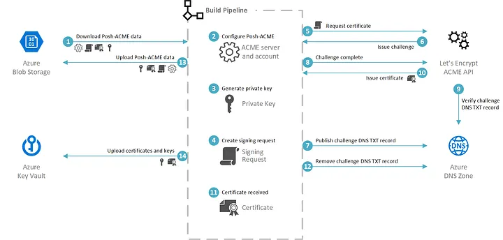
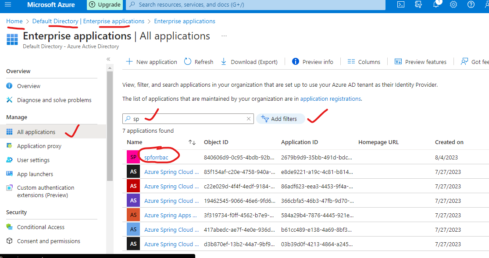

Key Points for Using KeyVault:
--------------------------------------

* Use RBAC's Predefined roles to grant access to users, groups and application at a specific scope(Keyvault contributor role at a specific scope)
* Access to key vault is controlled at 2 different interfaces: 
     - **Management Plane**: If you need to provide a user right to manage Keyvault properties such as tags etc., then RBAC should be used
     - **Data Plane**: If you need to provide an application access to keys,secrets or certificates then keyVault policies can be used to govern the data inside the key vault
* Enable the soft delete and purge protection features of keyvault to recover from unintentional or maliciuos deletion of keyvaults or key vault objects.
*  Treat deletion of keys as equal to deletion of data and practice keyvault recovery operations on regular basis
*  **NOTE:** If a user has contributor permissions (RBAC) to a key vault management plane, they can grant themselves access to the data plane by setting a keyvault access policy.
```
passwords: admin passwords
keys: service key, api key..
Certificates 
tokens: may be PAT tokens
```
**Certificates:** Currently called Transport Layer Security (TLS) certificates, also previously known as Secure Socket Layer (SSL) certificates, these private or public certificates help you secure internet connections by encrypting data sent between your browser, websites that you visit, and the website server.


**By intellipat: 
What is Azure Key Vault?**
- Azure Key Vault enables users to securely store and manage sensitive data like keys, passwords, certificates, and other sensitive information. These are kept in centralized storage that is protected by industry-standard algorithms and hardware security modules.
- This protects information from being revealed through source code, which is a common mistake made by many developers. Developers tend to leave sensitive information in their source code, such as database connection strings, passwords, and secret keys, which might lead to unintended repercussions if accessed by the wrong people. Access to a key vault necessitates proper authentication and authorization, and RBAC allows users to fine-tune who has what permissions over sensitive data.
  **The following concerns are resolved by Azure Key Vault:**
**Secrets Management** – Azure Key Vault may be used to store and control access to tokens, passwords, certificates, API keys, and other secrets securely.
**Key Management** – Azure Key Vault can also be used as a solution for key management. It makes it simple to generate and manage encryption keys for your data.
**Certificate Management** – Azure Key Vault also includes a certificate management solution that makes it simple to enroll, manage, and deploy public and private certificates for usage with Azure and other connected resources. 
There are two service tiers in **Azure Key Vault:** Standard, which encrypts using a software key, and Premium, which encrypts with keys protected by a hardware security module (HSM).


**Why Azure Key Vault?** The main advantages of using Key Vault in Azure are:

Centralize application secrets

Using Azure Key Vault to store application secrets centrally, you can regulate how they’re distributed. Secrets are much less likely to be mistakenly revealed using Key Vault.

When using Key Vault, application developers no longer need to store security information in their applications. The necessity to make security information part of the code is eliminated by not needing to store security information in apps.

For example, an application would need to connect to a database. Instead of storing the connection string in the app’s code, you can safely save it in Key Vault. URIs allow your applications to safely access the data they require.

Securely store secrets and keys

A user must first be authenticated and authorized before being granted access to a key vault. Authentication establishes the caller’s identity, whereas, authorization establishes the operations that they are permitted to carry out.

Authentication is done through Azure Active Directory. To authorize users, you can utilize Azure Role-based Access Control (Azure RBAC) or Key Vault access policies. When dealing with vault administration, Azure RBAC is used, whereas, a key vault access policy is used when attempting to access data stored in a vault.

Azure Key Vaults can be software-protected or hardware-protected by hardware security modules with the Key Vault Premium tier (HSMs). Azure uses industry-standard procedures and key lengths to protect software-protected keys, secrets, and certificates. For situations where you require more trust, you can import or generate keys in HSMs that never leave the HSM boundary.

Monitor access and use
After you’ve set up a few Key Vaults, you’ll want to keep track of how and when your keys and secrets are accessed. By activating logging for your vaults, you can keep track of what’s going on. Azure Key Vault can be configured to:
   - Archive to a storage account
   - Stream to an event hub 
   - Send the logs to Azure Monitor logs
You have complete control over your logs, and you can keep them safe by restricting access and removing records that are no longer needed.

Simplified administration of application secrets

Information about security must be kept safe, have a life cycle, and be highly accessible. Azure Key Vault makes achieving these requirements easier because of the following reasons:

Hardware Security Modules are no longer required to be known in-house
Scaling up to meet your organization’s use increases on short notice
Your Key Vault’s contents are copied within a region and to a secondary region.
Data replication ensures high availability and eliminates the requirement for the administrator to take any action to initiate the failover.
Standard Azure management options are available through the interface, the Azure CLI, and PowerShell.
Enrollment and renewal of certificates purchased from Public CAs are among the tasks that can be automated.
Integrate with other Azure services

Key Vault has been used as secure storage in Azure to simplify scenarios such as:

Disk Encryption in Azure
In SQL Server and Azure SQL Database
Azure App Service
Key Vault allows you to connect storage accounts, event hubs, and log analytics.

Refer here: https://intellipaat.com/blog/what-is-azure-key-vault/




Creating service principal: 


**Service principals are visible in AD:**
open AD
go to Enterprise Applications
clear all the filters and search for name


Keyvault in pipelines: 
First we have tp v