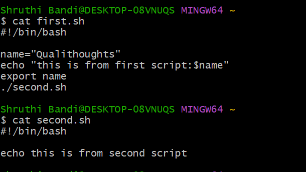
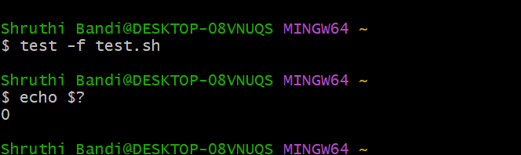

**Scripting Class**

1st day class - SUMMARY: abt shebang  & comments

2nd day class - SUMMARY: abt vars & naming conventions

name='test'
echo name - output test
number=9
echo $number + 1 output should be 10 but it converts into character & output will be 9+1
if we want to use arithmetic use echo $(( $(number) +1)) we get output 10
name conventions
use small letter or underscore to change variables such as test=’test’ my_num=9
if you don’t want to change vars then use constant naming conventions such as CAR=’audi
before use constant naming conventions check conventions are they already declared such as don’t use HOME, USERPATH
name=${1}
echo 'hello ${name}'
echo '0=${0} 1={1}'
when executing ./test.sh user
output will be put
hello user
0=./test.sh 1=user

This args are called positional arguments
First argument is ./test.sh
Second argument is user
So we get output
Hello (second argument which is) user
0=(first argument which is)./test.sh
1=(second argument which is) user
./test.sh user

   0      1

cp 1.txt 2.txt # 1.txt & 2.txt are positional arguments
 0  1     2
                    0      1

ping --count 4 google.com

google.com is positional argument
 where as 4 is named argument as it valued is called as count    --count=4


**adding 2 numbers:**

**using variables taking inputs from cmd line:**


**PARAMETERS & ARGUMENTS**
arguments i am writing in short form as args

./test.sh devops   azure    aws
           args    args     args

name=$1
     here $1 is paramter 
name=$2 
     here $2 is parameter

 name: is variable
 $1: is parameter
 devops azure: arguments 

$1-$9    Represent positional parameters for arguments one to nine
${10}-${n}    Represent positional parameters for arguments after nine
$0    Represent name of the script
$∗    Represent all the arguments as a single string
$@    Same as $∗, but differ when enclosed in (")
$#    Represent total number of arguments
$$    PID of the script
$?    Represent last return code

**Shell:**
A shell gives us an interface to the Unix system. While using an operating system, we indirectly interact with the shell. On Linux distribution systems, each time we use a terminal, we interact with the shell. The job of the shell is to interpret or analyze the Unix commands given by users. A shell accepts commands from the user and transforms them into a form that is understandable to the kernel. In other words, it acts as a mediator between the user and the kernel unit of the operating system.

**Non-interactive shell:**
As the name implies, a non-interactive shell is a type of shell that doesn’t interact with the user. We can run it through a script or similar. Also, it can be run through some automated process. In this case  .bashrc and .profile files do not get executed. The non-interactive shell influences the PATH variable. It is highly recommended to use the full path for a command in non-interactive shells. Non-interactive scripts can smoothly run in the background easily. This shell is generally a non-login shell because the calling user has logged in already. A shell that runs a script is always considered a non-interactive shell.

google for non interactive examples.

**Interactive shell:**
An interactive shell is defined as the shell that simply takes commands as input on tty from the user and acknowledges the output to the user. This shell also reads startup files that occurred during activation and displays a prompt. It also enables job control by default. It is also clear from the name, it is a shell with which we can interact. An interactive script is a script that requires input from the user. Interactive scripts couldn’t run in the background as they required input from the user.

**example of interactive shell**
read -p 'whats is ur name' name
read -p 'what program u are developing' program
read -p 'where do u belong from' belong

**output: **
what is ur name: test
what program u are developing: aws
where do u belong from: pakistan

if want to check ans enter

echo $name = test
echo $program = aws
echo $belong = pakistan

-----
**Shell in a shell :**



```
export: used for exporting someting out of shell, we can that variable from another shell
ex: export name from first.sh
is showed in second.sh 
```


**Debugging your scripts:**

bash -v ./debugdemo.sh text text 
bash -x ./debugdemo.sh text text

-v option displays the verbose output from bash
-x option, which displays the commands as they are executed and is most commonly used.
Enhancing interactive scripts
 
Lets understand how to limit number of characters entered
read -n1 -p 'hello what is ur name' 
after first character it will come back in normal stage bcoz we have restricted to not to go above 1 character if want to extend we can write
read -n10 (max 10 characters) -p 'hello what is ur name'
Lets understand how to control visibility of entered text, If we request for sensitive content like pin/password etc, its not a good approach to show the text while user is typing, Shell gives an option of hiding text when the user is typing. This can be achieved by adding a -s option to read command
read -s -p 'what is the pin' pin
output:
what is the pin: we type 1234 it wont sh0w context as it is sensitive but it is storing value
echo $pin 
output: 1234

```
--here the -n value is 1 so its taking only one letter for name
```

```
here -s is for sensitive info, which is invisible while entering
```

----
**error handling**
```
test -d /home/ubuntu 
echo $?
if directory is present then it will return success code 0 if not then it will return 1
like this we can test for like also
test -f /home/ubuntu/test.sh
echo $?
if file is present then 0 otherwise it will show 1

here -d: directory
-f file

shorthand method 
here we dont write test instead we write

[ -d /home/ubuntu ]
echo $?

same if directory is present then 0 otherwise 1 if not present same goes with file instead of -d (directory) we write -f (file)

[ -f /home/ubuntu/test.sh ]
echo $?
```

```
1 returns so there is no directory called ubuntu in my local machine
```

```
0 returned because test file is present
```
**If Syntax**
```
if then condition

if <condition> then
   statements
fi
```


 